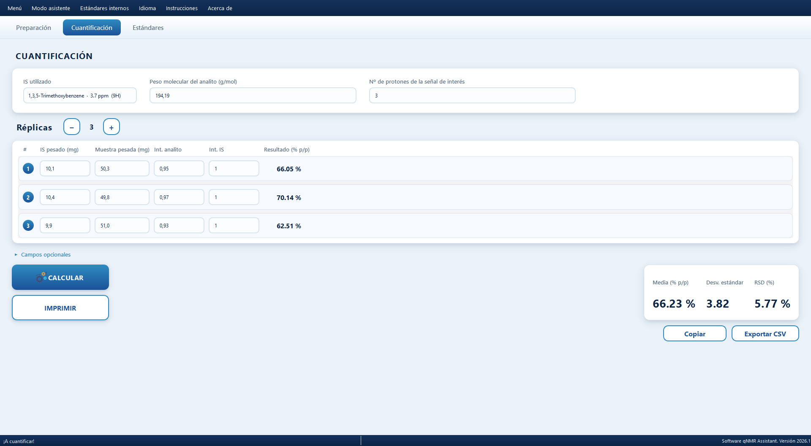

<p align="center">
  
</p>

<h1 align="center">qNMR Assistant</h1>

<p align="center">
  Desktop tool for quantitative <sup>1</sup>H&nbsp;NMR (qNMR): sample-preparation planning and
  concentration calculation with an internal standard.
</p>

<p align="center">
  <a href="https://github.com/JoseRaulBS/qNMR-Assistant/releases/latest"></a>
  <a href="https://github.com/JoseRaulBS/qNMR-Assistant/actions/workflows/release.yml"></a>
  
  
  <a href="LICENSE"></a>
</p>



## Download

| System | Direct download | How to run |
|---|---|---|
| Windows 10/11 (64-bit) | **[qNMR_Assistant-windows-x64.exe](https://github.com/JoseRaulBS/qNMR-Assistant/releases/latest/download/qNMR_Assistant-windows-x64.exe)** | Double-click. Portable, no installation. |
| Linux (x86-64) | **[qNMR_Assistant-linux-x64.tar.gz](https://github.com/JoseRaulBS/qNMR-Assistant/releases/latest/download/qNMR_Assistant-linux-x64.tar.gz)** | `tar -xzf` … then run `./qNMR_Assistant` |
| macOS (Apple Silicon) | **[qNMR_Assistant-macos-arm64.zip](https://github.com/JoseRaulBS/qNMR-Assistant/releases/latest/download/qNMR_Assistant-macos-arm64.zip)** | Unzip → right-click `qNMR Assistant.app` → *Open* |

Older versions: see the [Releases page](https://github.com/JoseRaulBS/qNMR-Assistant/releases).

> **Unsigned binaries.** This is academic software and the executables are not
> code-signed. Windows SmartScreen will ask for *"More info → Run anyway"* the
> first time; macOS requires right-click → *Open* once. Intel-Mac users should
> [run from source](#run-from-source).

## Features

- **Quantitation** — relative qNMR with internal standard: enter the measured
  integrals for up to 10 replicates and get % w/w per replicate plus mean,
  standard deviation and RSD. Optional sample density adds % w/v and g/L.
- **Sample preparation assistant** — given the expected analyte concentration,
  it recommends how much internal standard and sample to weigh (or pipette,
  for liquids) and generates a step-by-step protocol.
- **Internal-standard editor** — add or remove standards (name, MW, protons,
  purity, chemical shift); stored persistently per user.
- **One-page PDF report** and **CSV export** (Excel-friendly).
- **Bilingual interface** (English / Spanish), switchable at runtime.
- Decimal comma or point accepted everywhere; invalid fields highlighted.

## How it works

The quantitation implements the standard relative qNMR equation:

```
P_x (% w/w) = (I_x / I_IS) · (N_IS / N_x) · (M_x / M_IS) · (m_IS / m_x) · P_IS · 100
```

where `I` are the measured integrals, `N` the number of protons of each signal,
`M` the molecular weights, `m` the weighed masses and `P_IS` the purity of the
internal standard. The formulas are validated by the test suite in
[`test_formulas.py`](test_formulas.py), which runs on every release build.

## Run from source

```bash
git clone https://github.com/JoseRaulBS/qNMR-Assistant.git
cd qNMR-Assistant
python -m venv venv
# Windows: venv\Scripts\activate   |   macOS/Linux: source venv/bin/activate
pip install -r requirements.txt
python app.py
```

Requires Python ≥ 3.10. The only runtime dependency is PyQt6.

## Build the executables

See [BUILD.md](BUILD.md). Releases are built automatically by
[GitHub Actions](.github/workflows/release.yml) on Windows, Linux and macOS
runners whenever a `v*` tag is pushed.

## User data

Standards and preferences are stored per user (not next to the executable):

- Windows: `%APPDATA%\qNMR\qNMR Assistant\`
- macOS: `~/Library/Application Support/qNMR Assistant/`
- Linux: `~/.local/share/qNMR Assistant/`

## License & author

[MIT](LICENSE) — created by **José Raúl Belmonte** (2023), unified and updated
in 2026. Contact: joseraulbs@gmail.com ·
[github.com/JoseRaulBS](https://github.com/JoseRaulBS)
